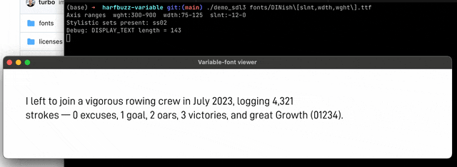

# HarfBuzz Variable Font Preview

A HiDPI-ready, minimal preview renderer for viewing variable TTF fonts using HarfBuzz and FreeType (and SDL3 purely for preview). Included are the most common open-source free-use variable fonts, which demonstrate a variety of variable parameters and style sets.

This code is dedicated to the public domain, or licenses under CC0 (your choice). Included fonts have their own licenses, see `licenses/`.



## Building

Install deps, for example on macOS:

```bash
brew update
brew install freetype
brew install harfbuzz
brew install sdl3
```

Note that SDL3 and HB are in active development. This has been tested on macOS 15.4.1 with **HarfBuzz 11.1.0** and **SDL 3.2.10**. You may want to install HEAD versions.

Build and run:

```bash
make
./demo_sdl3 font.ttf # [#RRGGBB]
```

## Preview

* <kbd>Q</kbd>/<kbd>A</kbd>: change weight axis value
* <kbd>W</kbd>/<kbd>S</kbd>: change width axis value
* <kbd>E</kbd>/<kbd>D</kbd>: change slant angle

### Notes on variants

Remember that most variable fonts still come in two versions: *Regular* and *Italic*, because the default shear-only transform does not usually yield acceptable visuals for italics.

The included demo font *Mona Sans Combined* for example can slant on-demand, whereas *Inter* cannot (hence the second *Italic* version).

By convention, the font file name should include the supported parameters. Native variable fonts (such as *Science Gothic*) contain many more parameters (contrast, etc.), but this previewer only considers the three most common listed above. Some fonts may be highly parametric, see e.g. [Decovar](https://github.com/googlefonts/decovar?tab=readme-ov-file#axes).

The previewer auto-detects the valid value ranges for each parameter.

### Notes on style sets

Style sets change the appearance of one or more font element, e.g. double-storey `a`. The previewer detects all supported style sets and you can use <kbd>1</kbd> through <kbd>9</kbd> to enable/disable them.